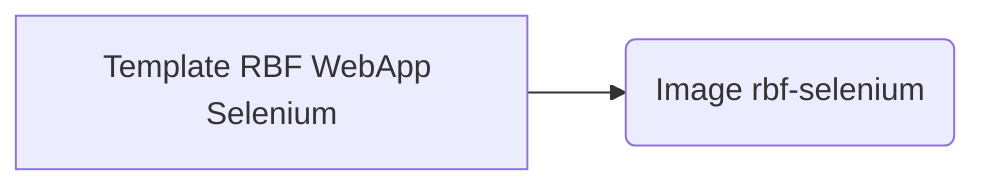

### Dépendances importantes
#### Image

#### Gestion des versions
    Template RBF WebApp Selenium
    https://git.devops.etat-ge.ch/gitlab/tests/robotframework/templates/template-rbf-webapp-se.git 
    Politique de mise à jour:
        - Chaque majeur release (major + 1)
        - Minimum tous les 6 mois
        - Lors de la mise à jour de l'image rbf-selenium si nécessarie.
    major.minor[.maintenance[.revision]]
    major: Mise à jour majeur, nouvelle(s) version(s) de librairie
    minor(patch): Nouvelle fonctionnalitée, mise à jour de librairie
    maintenance: Corrections de bug, correctifs
    Requires: Python >=3.6, <4